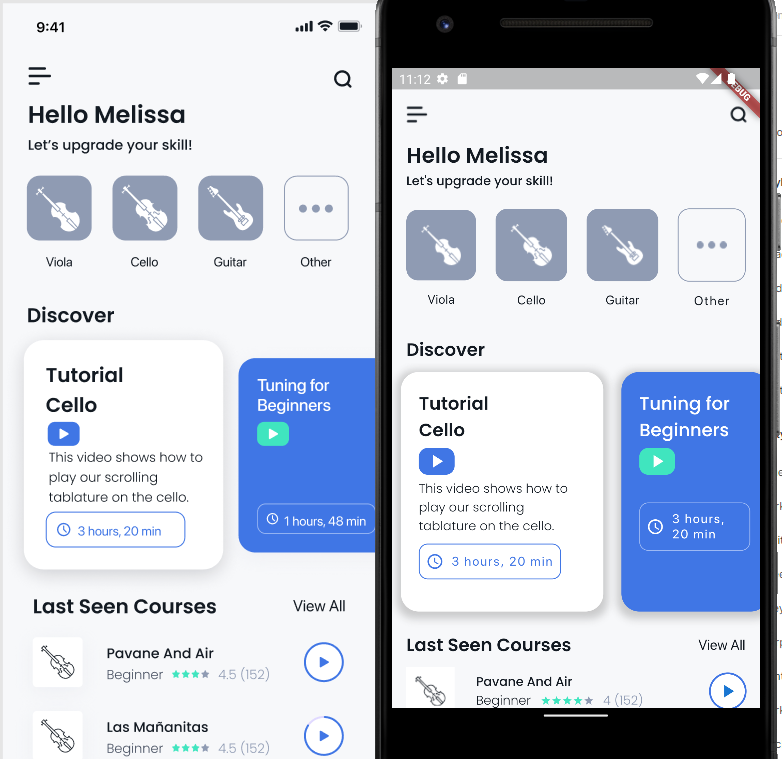
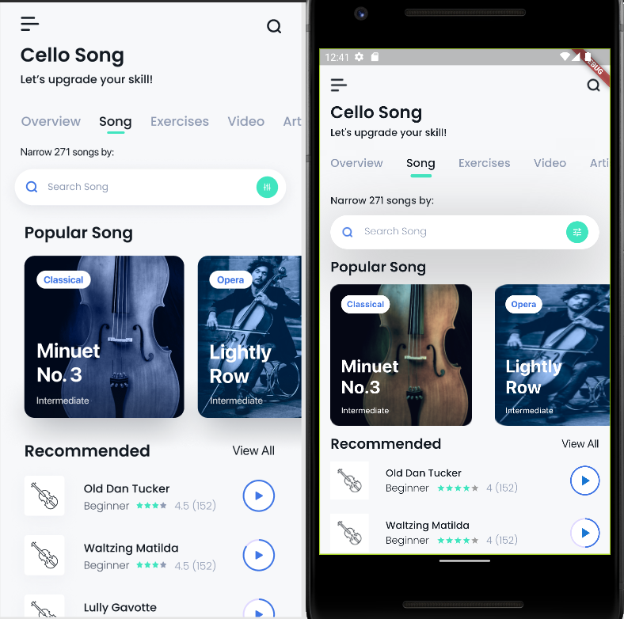
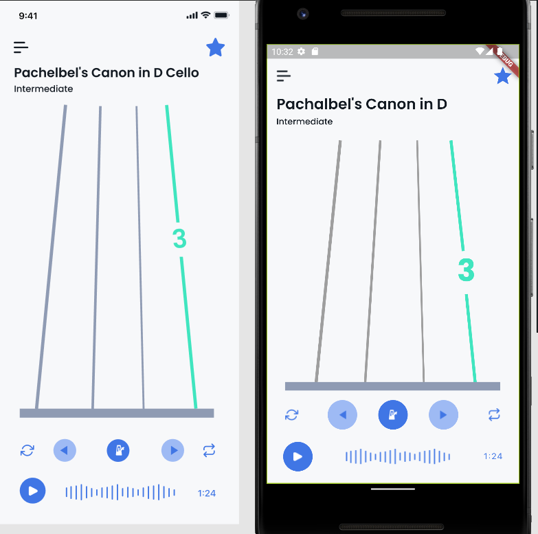

# StringClub

A Music Course App UI implementation with Flutter. This app is not a functional app. I was just trying to implement the UI design with Flutter.

The design belongs to [Betül Üsküdar](https://twitter.com/uskusku). You should definitely check her designs on https://dribbble.com/betuluskudar

